# Trip → Route → Route Optimization: Architecture & Code Walkthrough

This is a deep-dive companion to the root [`README.md`](./README.md), focused entirely on the
**non-ML** slice of the platform: creating a trip, building a multi-stop route, geocoding stops,
optimizing stop order, and computing a weather-adjusted ETA. ML (delay prediction, fuel-cost
prediction, ML ETA) is intentionally out of scope here — see `ml/README.md` for that.

## Table of contents

1. [System architecture](#1-system-architecture)
2. [Data model](#2-data-model)
3. [Status lifecycles](#3-status-lifecycles)
4. [Workflow A — Creating a Trip](#4-workflow-a--creating-a-trip)
5. [Workflow B — Building a multi-stop Route](#5-workflow-b--building-a-multi-stop-route)
6. [Workflow C — Route Optimization (TSP solver)](#6-workflow-c--route-optimization-tsp-solver)
7. [Workflow D — Weather-adjusted ETA](#7-workflow-d--weather-adjusted-eta)
8. [End-to-end sequence](#8-end-to-end-sequence)
9. [Design rationale & FAQ](#9-design-rationale--faq)
10. [API reference](#10-api-reference)
11. [File map](#11-file-map)

---

## 1. System architecture

Three independently-run processes talk over plain HTTP — nothing here is ML:

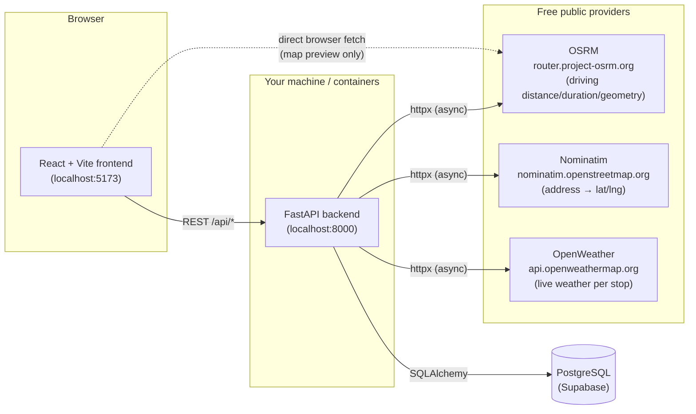

Two things worth calling out because they trip people up:

- **OSRM is called from two places.** The backend calls it server-side when *optimizing* stop
  order (`route_optimizer.py`) and when computing the *weather-adjusted ETA* (`eta_service.py`).
  The frontend **also** calls it directly from the browser (`useRoadRoute.ts`) purely to draw the
  route line and show a live distance/duration while you're still editing the route form — before
  anything is saved. These are two separate OSRM calls for two separate purposes; they are not
  wired together.
- **Nominatim is rate/IP limited.** It's a free public demo instance with a strict usage policy —
  if geocoding starts returning `502` from `/api/geocode`, it's very likely Nominatim itself
  returning `403 Forbidden`, not a bug in this codebase.

### 1.1 Where each piece of code lives

The diagram above is about *processes*; this one is about *modules within the backend/frontend*,
so you can go straight to the right file for a given layer:

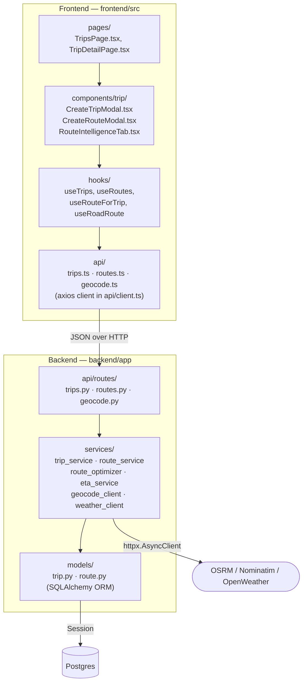

Routers are deliberately thin (parse request → call one service function → return); all business
logic lives in `services/`. Frontend components never call `axios`/`fetch` directly — they go
through a hook (`useRoutes`, `useRoadRoute`, ...) which wraps a function in `api/*.ts`.

---

## 2. Data model

Two tables matter for this slice: `trips` (pre-existing, real production schema) and
`routes` / `route_stops` (this feature's own tables, linked to `trips` by `trip_id`).

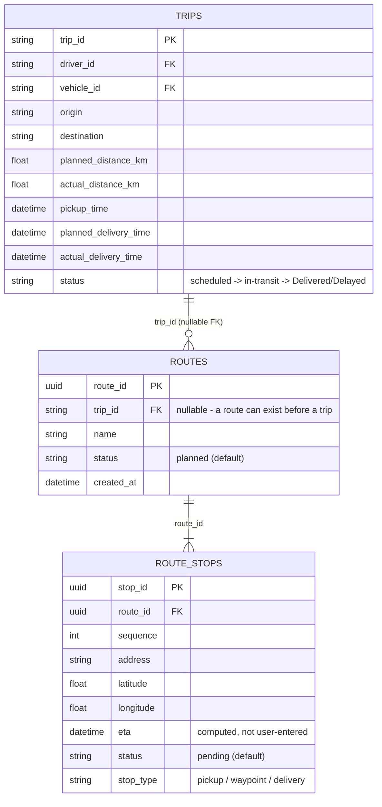

Key design point: **a `Route` can exist without a `Trip`.** You can build and optimize a route
first (`trip_id = NULL`), then later attach it to a trip (`PATCH /routes/{id}/trip`) — or build a
trip and only then jump into "Build a new multi-stop route instead". Both directions are
supported in the UI (see `CreateTripModal`'s `RouteStep`).

- Backend models: [`backend/app/models/trip.py`](./backend/app/models/trip.py),
  [`backend/app/models/route.py`](./backend/app/models/route.py)
- Pydantic I/O schemas: [`backend/app/schemas/trip.py`](./backend/app/schemas/trip.py),
  [`backend/app/schemas/route.py`](./backend/app/schemas/route.py)

---

## 3. Status lifecycles

Status is the one piece of state that changes *after* creation, on both `Trip` and `Route`/`RouteStop`
— and each behaves differently, which is easy to get wrong when reading the code cold.

### 3.1 Trip status

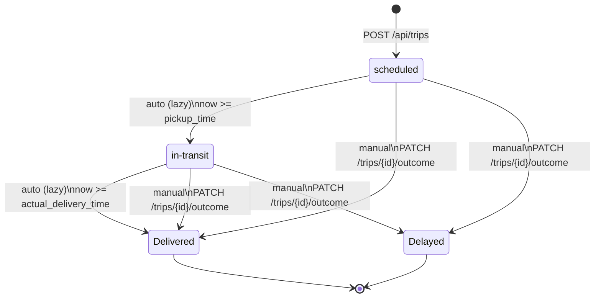

The **auto** transitions (top) aren't driven by a background job — there isn't one. Instead,
`trip_service._apply_auto_status_transition` runs *every time a trip is read* (`get_trip`,
`list_trips`), compares `now` against `pickup_time`/`actual_delivery_time`, and silently advances
the status before returning the trip — persisting the change first if it moved. It only ever acts
on trips currently in `{scheduled, in-transit}`, so it can never clobber a `Delayed`/`Delivered`
that was set deliberately. The **manual** transition (bottom, `complete_trip`) is the one place a
real `delay_minutes` and `actual_delivery_time` get recorded, and is what other rolling-history
features (outside this slice) key off of via `Trip.RESOLVED_STATUSES = ("Delayed", "Delivered")`.

### 3.2 Route / RouteStop status — stored vs. computed

This is the subtler one: the `status` column on both `Route` and `RouteStop` is set once at
creation (`"planned"` / `"pending"`) and then **never updated by anything in this codebase**. What
you actually see rendered per-stop in Route Intelligence is a *separate*, non-persisted
`computed_status`, re-derived from real GPS data on every single `GET /api/routes*` call:

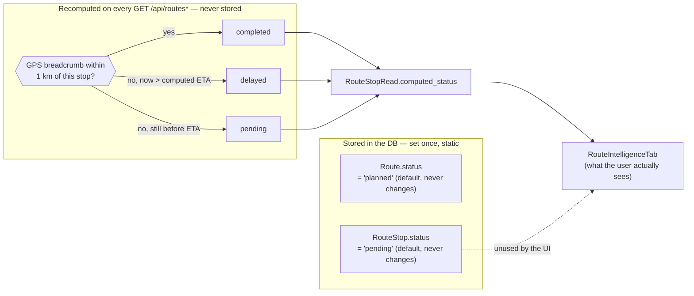

In other words: `RouteStop.status` exists in the schema but is effectively vestigial for display
purposes today — `_infer_stop_statuses` in `eta_service.py` is the real source of truth for what
a stop's status *looks like* to a user, computed fresh from GPS breadcrumbs and the weather-adjusted
ETA every time, not read from a column.

---

## 4. Workflow A — Creating a Trip

### 4.1 What the user does

`CreateTripModal` is a 5-step wizard: **Route → Driver → Vehicle → Load → Review**.

1. **Route** — pick an already-saved route from a dropdown (`GET /api/routes`), or bail out to
   "Build a new multi-stop route instead" (opens the route modal — Workflow B).
2. **Driver** — pick from the live driver roster; drivers already `is_on_trip` are shown but
   disabled.
3. **Vehicle** — same idea, from the vehicle roster.
4. **Load** — weight (required), free-text description, value.
5. **Review** — pick a pickup date/time, see a computed summary, hit **Schedule trip**.

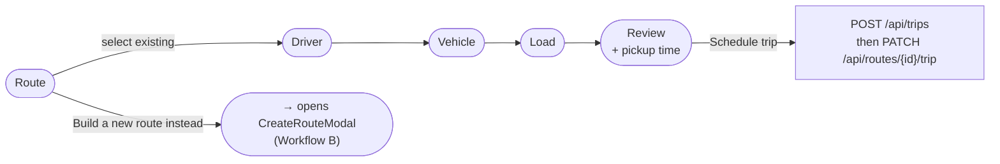

### 4.2 Frontend: deriving trip fields from the selected route

The trip's `origin`/`destination`/GPS coordinates aren't typed in by the user — they're derived
from the *first* and *last* stop of the selected route (sorted by `sequence`):

```ts
// frontend/src/components/trip/CreateTripModal.tsx
function routeEndpoints(route: Route) {
  const sorted = [...route.stops].sort((a, b) => a.sequence - b.sequence);
  const first = sorted[0];
  const last = sorted[sorted.length - 1];
  return {
    origin: first?.address ?? "Unknown",
    destination: last?.address ?? "Unknown",
    stopCount: sorted.length,
    startLat: first?.latitude ?? null,
    startLon: first?.longitude ?? null,
    endLat: last?.latitude ?? null,
    endLon: last?.longitude ?? null,
  };
}
```

The planned distance/duration also isn't user-entered — it comes from `useRoadRoute` (a live
browser→OSRM call over the route's stop coordinates, see [§5.3](#53-live-preview-frontend--osrm-direct)),
and `planned_delivery_time` is derived by adding that duration to the chosen pickup time:

```ts
// frontend/src/components/trip/CreateTripModal.tsx (inside the create mutation)
const durationHours = roadRoute.durationHours ?? 0;
const plannedDelivery = pickupDateTime
  ? new Date(new Date(pickupDateTime).getTime() + durationHours * 3600 * 1000).toISOString()
  : null;

const trip = await createTrip({
  driver_id: selectedDriver.driver_id,
  vehicle_id: selectedVehicle.vehicle_id,
  origin, destination,
  gps_start_lat: startLat, gps_start_lon: startLon,
  gps_end_lat: endLat, gps_end_lon: endLon,
  pickup_time: pickupIso,
  planned_delivery_time: plannedDelivery,
  planned_distance_km: roadRoute.distanceKm ?? null,
  load_weight_kg: loadWeightKg ? Number(loadWeightKg) : null,
  load_value: loadValue ? Number(loadValue) : null,
});

// Tie the selected route back to the trip it was actually used for.
await assignRouteToTrip(selectedRoute.route_id, trip.trip_id);
```

Two API calls happen on submit, in order: **1)** `POST /api/trips` creates the trip, **2)**
`PATCH /api/routes/{route_id}/trip` attaches the just-created `trip_id` back onto the route that
was used to plan it (this is the same endpoint `assign_trip` in `route_service.py` powers).

### 4.3 Backend: `POST /api/trips`

```python
# backend/app/api/routes/trips.py
@router.post("", response_model=TripRead, status_code=201)
def create_trip(trip_in: TripCreate, db: Session = Depends(get_db)):
    try:
        return trip_service.create_trip(db, trip_in)
    except trip_service.DuplicateIdError as exc:
        raise HTTPException(status_code=409, detail=str(exc))
```

```python
# backend/app/services/trip_service.py
def _generate_trip_id() -> str:
    return f"TRP-{uuid.uuid4().hex[:8].upper()}"

def create_trip(db: Session, trip_in: TripCreate) -> Trip:
    trip_data = trip_in.model_dump()

    # Demo-only: no live telemetry feed, so "actual" outcomes are derived
    # deterministically from planned values instead of staying NULL forever.
    if trip_data.get("planned_distance_km") is not None:
        trip_data["actual_distance_km"] = round(trip_data["planned_distance_km"] * DEMO_ACTUAL_DISTANCE_FACTOR, 1)
    if trip_data.get("planned_delivery_time") is not None:
        trip_data["actual_delivery_time"] = trip_data["planned_delivery_time"] + timedelta(
            minutes=DEMO_ACTUAL_DELIVERY_OFFSET_MINUTES
        )

    trip = Trip(trip_id=_generate_trip_id(), status="scheduled", **trip_data)
    db.add(trip)
    try:
        db.commit()
    except IntegrityError as exc:
        db.rollback()
        raise DuplicateIdError(f"Trip {trip.trip_id} already exists") from exc
    db.refresh(trip)
    return trip
```

Notes:
- `trip_id` is generated server-side (`TRP-XXXXXXXX`), never client-supplied.
- Every new trip starts as `status = "scheduled"`.
- See [§3.1](#31-trip-status) for the full status lifecycle (auto vs. manual transitions).

---

## 5. Workflow B — Building a multi-stop Route

This is `CreateRouteModal.tsx` — the biggest piece of UI in this slice.

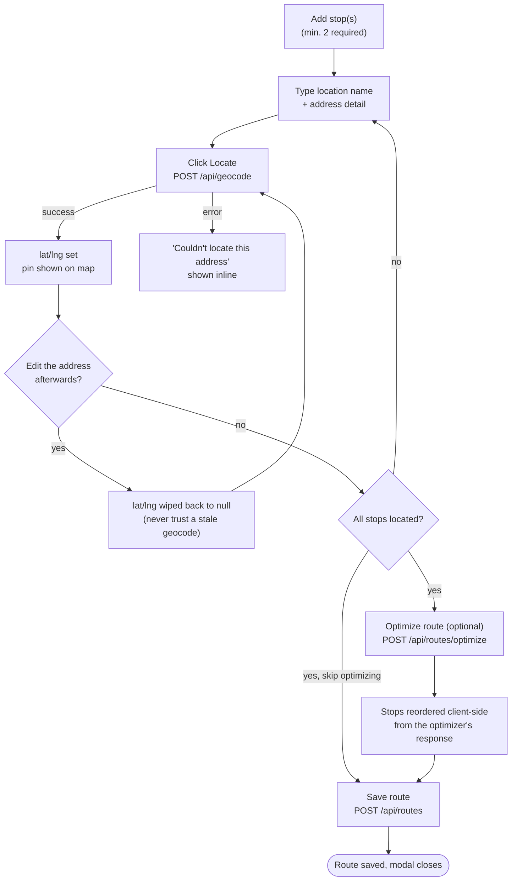

### 5.1 Add stops

Each stop starts as a blank form row (`makeStop()` generates a client-side-only `crypto.randomUUID()`
`key` used purely for React list identity and to match up the optimizer's response — it's never
sent to the backend as `stop_id`):

```ts
function makeStop(): StopForm {
  return {
    key: crypto.randomUUID(),
    locationName: "", addressDetail: "", stopType: "waypoint",
    latitude: null, longitude: null, errorRadius: null,
    geocodeStatus: "idle",
  };
}
```

Stops can be reordered (`moveStop`, swaps two array entries) or deleted. Each stop's own geocode
state machine looks like this — note editing the address after a successful geocode drops straight
back to `idle` with coordinates wiped, not to `error`:

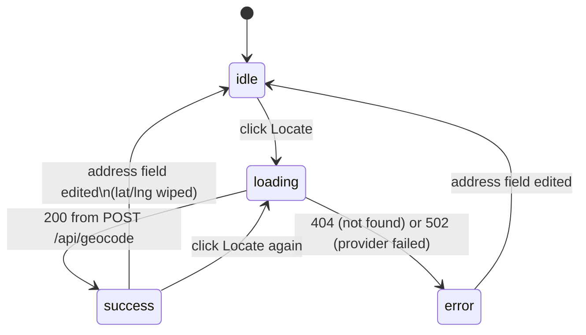

```ts
const updateAddressField = (key: string, patch: Partial<StopForm>) =>
  setStops((prev) =>
    prev.map((s) =>
      s.key === key
        ? { ...s, ...patch, latitude: null, longitude: null, errorRadius: null, geocodeStatus: "idle" }
        : s,
    ),
  );
```

### 5.2 Geocoding — turning an address into coordinates

Clicking **Locate** on a stop calls the backend, which forwards to Nominatim (OpenStreetMap):

```ts
// frontend/src/components/trip/CreateRouteModal.tsx
const locateStop = async (stop: StopForm) => {
  const address = stopAddress(stop);
  updateStop(stop.key, { geocodeStatus: "loading" });
  try {
    const result = await geocodeAddress(address);
    updateStop(stop.key, {
      latitude: result.lat, longitude: result.lng,
      errorRadius: result.error_radius, geocodeStatus: "success",
    });
  } catch {
    updateStop(stop.key, { geocodeStatus: "error" });
  }
};
```

```python
# backend/app/api/routes/geocode.py
@router.post("", response_model=GeocodeResult)
async def geocode(request: GeocodeRequest):
    return await geocode_address(request.address)
```

```python
# backend/app/services/geocode_client.py
async def geocode_address(address: str) -> GeocodeResult:
    """Forward-geocodes a free-text address via Nominatim (OpenStreetMap).
    Free, no API key - but Nominatim's usage policy requires an identifying
    User-Agent and caps usage at ~1 request/second."""
    params = {"q": address, "format": "json", "limit": 1}
    headers = {"User-Agent": settings.GEOCODE_USER_AGENT}

    async with httpx.AsyncClient(timeout=10.0) as client:
        response = await client.get(settings.NOMINATIM_URL, params=params, headers=headers)

    if response.status_code != 200:
        raise HTTPException(status_code=502, detail=f"Geocoding provider returned {response.status_code}")

    results = response.json()
    if not results:
        raise HTTPException(status_code=404, detail="Address not found")

    match = results[0]
    return GeocodeResult(lat=float(match["lat"]), lng=float(match["lon"]), error_radius=None)
```

The backend is a thin proxy here — it exists mainly so the Nominatim `User-Agent` requirement
(and, in production, an API key for a paid provider) lives server-side instead of in browser JS.
A `404` means "address not found"; a `502` means the *provider itself* failed (network error, rate
limit, non-200 response) — the frontend shows "Couldn't locate this address" for both.

### 5.3 Live preview (frontend → OSRM direct)

Once ≥2 stops are geocoded, `useRoadRoute` fetches an actual driving route straight from the
browser to OSRM's public demo server — no backend round-trip, so the map/distance/duration update
live as you add or reorder stops, before you've saved anything:

```ts
// frontend/src/hooks/useRoadRoute.ts
export function useRoadRoute(positions: [number, number][]): RoadRoute {
  // ...
  const coordsParam = positions.map(([lat, lng]) => `${lng},${lat}`).join(";");
  const url = `https://router.project-osrm.org/route/v1/driving/${coordsParam}?overview=full&geometries=geojson`;

  fetch(url).then(res => res.json()).then(data => {
    const route = data?.routes?.[0];
    setState({
      geometry: route.geometry.coordinates.map(([lng, lat]) => [lat, lng]),
      distanceKm: route.distance / 1000,
      durationHours: route.duration / 3600,
      isLoading: false, isError: false,
    });
  });
  // ...
}
```

This drives the "Total distance / Est. duration / Est. tolls" summary tiles in the modal (tolls
are a flat `₹2/km` heuristic — there's no real toll API wired in) and the live line drawn on
`RouteMapPreview` (Leaflet).

### 5.4 Saving the route

**Save route** posts the whole route (stops included) in one request:

```ts
// frontend/src/components/trip/CreateRouteModal.tsx
const mutation = useMutation({
  mutationFn: () =>
    createRoute({
      trip_id: tripId,
      stops: stops.map((stop, index) => ({
        sequence: index + 1,
        address: stopAddress(stop),
        latitude: stop.latitude,
        longitude: stop.longitude,
        stop_type: stop.stopType,
      })),
    }),
  onSuccess: () => {
    queryClient.invalidateQueries({ queryKey: ["routes"] });
    setStops([makeStop(), makeStop()]);
    onClose();
  },
});
```

```python
# backend/app/api/routes/routes.py
@router.post("", response_model=RouteRead, status_code=201)
def create_route(route_in: RouteCreate, db: Session = Depends(get_db)):
    return route_service.create_route(db, route_in)
```

```python
# backend/app/services/route_service.py
def create_route(db: Session, route_in: RouteCreate) -> Route:
    route = Route(trip_id=route_in.trip_id, name=route_in.name)
    db.add(route)
    db.flush()  # assigns route.route_id before the stops need it as a FK

    for position, stop_in in enumerate(route_in.stops, start=1):
        stop_data = stop_in.model_dump()
        if stop_data.get("sequence") is None:
            stop_data["sequence"] = position
        db.add(RouteStop(route_id=route.route_id, **stop_data))

    db.commit()
    db.refresh(route)
    return route
```

`route.status` defaults to `"planned"` at the DB level (`Route.status` column default); each
`RouteStop.status` defaults to `"pending"`. As covered in [§3.2](#32-route--routestop-status--stored-vs-computed),
nothing in this codebase writes those columns to anything else afterward — the *displayed*
per-stop status is computed fresh on every read (see [§7](#7-workflow-d--weather-adjusted-eta)).

---

## 6. Workflow C — Route Optimization (TSP solver)

### 6.1 Trigger

Clicking **Optimize route** (enabled once every stop is geocoded) sends just the stop
coordinates — nothing is persisted yet, this is a pure computation:

```ts
// frontend/src/components/trip/CreateRouteModal.tsx
const result = await optimizeRouteOrder(
  stops.map((s) => ({ key: s.key, latitude: s.latitude, longitude: s.longitude })),
);
const byKey = new Map(stops.map((s) => [s.key, s]));
const reordered = result.order.map((key) => byKey.get(key)).filter(Boolean);
setStops(reordered); // re-renders the form + map in the new order
```

```ts
// frontend/src/api/routes.ts
export async function optimizeRouteOrder(stops: OptimizeStopInput[]): Promise<OptimizeRouteResult> {
  const { data } = await apiClient.post<OptimizeRouteResult>("/routes/optimize", { stops });
  return data;
}
```

The first stop is always treated as a **fixed starting point** (e.g. your depot/pickup) — the
solver only reorders everything *after* it.

### 6.2 Backend: distance/duration matrix via OSRM `/table`

```python
# backend/app/services/route_optimizer.py
async def _fetch_matrices(stops: list[OptimizeStopInput]) -> tuple[list[list[float]], list[list[float]]]:
    coords = ";".join(f"{s.longitude},{s.latitude}" for s in stops)
    url = f"{settings.OSRM_BASE_URL}/table/v1/driving/{coords}?annotations=duration,distance"

    async with httpx.AsyncClient(timeout=15.0) as client:
        response = await client.get(url)

    data = response.json()
    return data["durations"], data["distances"]  # NxN matrices, seconds / meters
```

Unlike `/route` (a single path), OSRM's `/table` endpoint returns a full **N×N matrix** of
travel duration and distance between every pair of stops in one call — exactly what a TSP solver
needs as its cost function.

### 6.3 Two solvers, chosen by stop count

```python
EXACT_SOLVER_MAX_STOPS = 12

def _solve_order(cost: list[list[float]]) -> list[int]:
    n = len(cost)
    if n <= EXACT_SOLVER_MAX_STOPS:
        return _held_karp_open_path(cost)          # exact optimum
    return _two_opt(_nearest_neighbor(cost), cost)  # fast heuristic
```

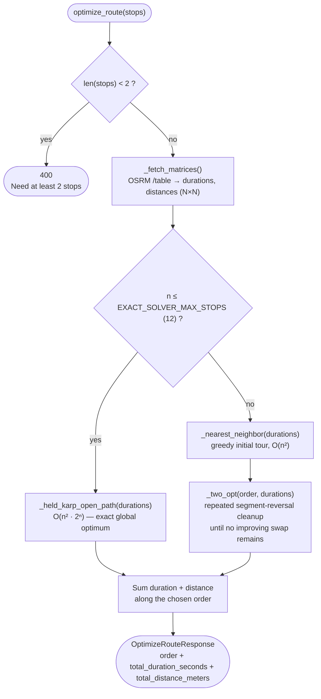

**≤12 stops → exact Held-Karp dynamic programming.** This is the textbook DP formulation of the
open-path (no-return-to-start) Traveling Salesman Problem: `dp[mask][j]` = cheapest cost to have
visited exactly the stop set `mask`, ending at stop `j`. `O(n² · 2ⁿ)` time — fine up to ~12 stops,
explosive beyond that (2¹² = 4096 masks × 12² transitions; 2²⁰ would be 400× that).

```python
def _held_karp_open_path(cost: list[list[float]]) -> list[int]:
    n = len(cost)
    size = 1 << n
    dp = [[math.inf] * n for _ in range(size)]
    parent = [[-1] * n for _ in range(size)]
    dp[1][0] = 0.0  # mask={stop 0}, currently at stop 0, cost 0

    for mask in range(size):
        if not (mask & 1):          # every valid state must include the fixed start
            continue
        for j in range(n):
            if not (mask & (1 << j)) or dp[mask][j] == math.inf:
                continue
            for k in range(n):
                if mask & (1 << k):  # k already visited
                    continue
                new_mask = mask | (1 << k)
                new_cost = dp[mask][j] + cost[j][k]
                if new_cost < dp[new_mask][k]:
                    dp[new_mask][k] = new_cost
                    parent[new_mask][k] = j

    full_mask = size - 1
    best_end = min(range(n), key=lambda j: dp[full_mask][j])

    # Walk parent pointers back from (full_mask, best_end) to reconstruct the path.
    order, mask, node = [], full_mask, best_end
    while node != -1:
        order.append(node)
        mask, node = mask ^ (1 << node), parent[mask][node]
    order.reverse()
    return order
```

**>12 stops → nearest-neighbor + 2-opt heuristic.** Greedily walk to the closest unvisited stop
each step, then repeatedly try reversing sub-segments of the path whenever that reduces total
cost, until no single reversal helps any more (a local optimum, not guaranteed global):

```python
def _nearest_neighbor(cost: list[list[float]]) -> list[int]:
    n = len(cost)
    visited = [False] * n
    visited[0] = True
    order = [0]
    for _ in range(n - 1):
        last = order[-1]
        nxt = min((j for j in range(n) if not visited[j]), key=lambda j: cost[last][j])
        visited[nxt] = True
        order.append(nxt)
    return order

def _two_opt(order: list[int], cost: list[list[float]]) -> list[int]:
    n = len(order)
    improved = True
    while improved:
        improved = False
        for i in range(1, n - 1):
            for j in range(i + 1, n):
                a, b, c = order[i - 1], order[i], order[j]
                d = order[j + 1] if j + 1 < n else None
                before = cost[a][b] + (cost[c][d] if d is not None else 0)
                after = cost[a][c] + (cost[b][d] if d is not None else 0)
                if after < before - 1e-9:
                    order[i:j + 1] = reversed(order[i:j + 1])
                    improved = True
    return order
```

The optimizer is minimizing **duration** (`durations` matrix), not distance — the response
separately reports both totals for whatever order was chosen:

```python
async def optimize_route(stops: list[OptimizeStopInput]) -> OptimizeRouteResponse:
    if len(stops) < 2:
        raise HTTPException(status_code=400, detail="Need at least 2 stops to optimize")

    durations, distances = await _fetch_matrices(stops)
    order = _solve_order(durations)

    total_duration = sum(durations[order[i]][order[i + 1]] for i in range(len(order) - 1))
    total_distance = sum(distances[order[i]][order[i + 1]] for i in range(len(order) - 1))

    return OptimizeRouteResponse(
        order=[stops[i].key for i in order],  # client-side keys, echoed back in optimized order
        total_duration_seconds=total_duration,
        total_distance_meters=total_distance,
    )
```

The frontend then diffs the *before* (pre-optimization `useRoadRoute` numbers) against the
*after* (the optimizer's numbers) and toasts something like *"Route optimized: saved 12 km and 12
min"* — or *"this order was already the fastest"* if the saving is negligible (< 0.5 km / < 0.5 min).

---

## 7. Workflow D — Weather-adjusted ETA

This runs automatically whenever routes are listed/fetched (`GET /api/routes`,
`GET /api/routes/{id}`) — it's what powers the Route Intelligence tab's "Weather-Adjusted ETA"
card and each stop's live weather + computed status. It combines OSRM (routing) with OpenWeather
(live conditions) — still no ML involved, just a rule-based multiplier table.

```python
# backend/app/api/routes/routes.py
async def _enrich_with_weather_eta(db: Session, route: Route) -> RouteRead:
    """Best-effort: falls back to the plain route if <2 geocoded stops,
    OPENWEATHER_API_KEY unset, or OSRM/OpenWeather is unreachable."""
    route_data = RouteRead.model_validate(route)
    try:
        estimate, stop_etas, stop_weather, stop_statuses = await eta_service.estimate_weather_adjusted_eta(
            db, route.route_id
        )
    except (eta_service.InsufficientRouteDataError, HTTPException):
        return route_data

    route_data.weather_eta = estimate
    for stop in route_data.stops:
        if stop.stop_id in stop_etas:
            stop.eta = stop_etas[stop.stop_id]
        if stop.stop_id in stop_statuses:
            stop.computed_status = stop_statuses[stop.stop_id]
        # ...attach per-stop weather fields...
    return route_data

@router.get("", response_model=list[RouteRead])
async def list_routes(skip: int = 0, limit: int = 100, trip_id: str | None = None, db: Session = Depends(get_db)):
    routes = route_service.list_routes(db, skip, limit, trip_id)
    return await asyncio.gather(*(_enrich_with_weather_eta(db, route) for route in routes))
```

### 7.1 Pipeline, step by step

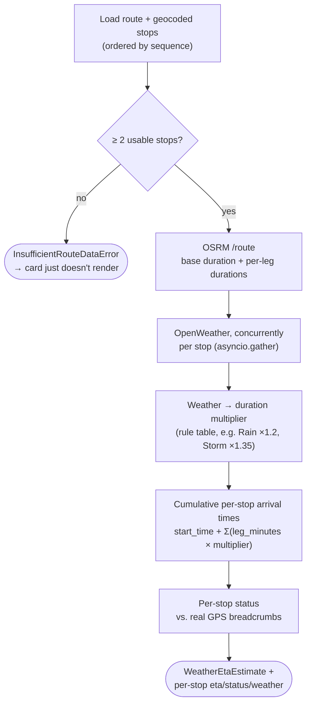

`eta_service.estimate_weather_adjusted_eta(db, route_id)`:

1. **Load the route + its geocoded stops** (skip stops with no lat/lng), ordered by `sequence`.
   Fewer than 2 usable stops → `InsufficientRouteDataError` (caught above, ETA card just doesn't render).
2. **Base duration**, via OSRM `/route` (same idea as [§5.3](#53-live-preview-frontend--osrm-direct),
   called server-side this time) — also returns **per-leg** durations, one per consecutive stop pair:
   ```python
   async def _fetch_osrm_route(stops):
       coords = ";".join(f"{s.longitude},{s.latitude}" for s in stops)
       url = f"{settings.OSRM_BASE_URL}/route/v1/driving/{coords}?overview=false"
       async with httpx.AsyncClient(timeout=15.0) as client:
           response = await client.get(url)
       route = response.json()["routes"][0]
       leg_durations_minutes = [leg["duration"] / 60 for leg in route.get("legs", [])]
       return route["duration"] / 60, route["distance"] / 1000, leg_durations_minutes
   ```
3. **Live weather at every stop**, fetched concurrently via OpenWeather — one stop's provider
   failure doesn't sink the others:
   ```python
   async def _fetch_all_stop_weather(stops):
       async def fetch(stop):
           try:
               weather = await weather_client.get_current_weather(stop.latitude, stop.longitude)
           except HTTPException:
               return stop.stop_id, None
           return stop.stop_id, _weather_summary(weather)
       results = await asyncio.gather(*(fetch(s) for s in stops))
       return {stop_id: summary for stop_id, summary in results if summary is not None}
   ```
4. **Weather → duration multiplier**, a hand-authored table (not ML) applied per-leg based on the
   weather at the leg's *arrival* stop:
   ```python
   WEATHER_DELAY_MULTIPLIERS = {
       "Clear": 1.0, "Clouds": 1.0, "Drizzle": 1.1, "Rain": 1.2,
       "Thunderstorm": 1.35, "Snow": 1.4, "Mist": 1.2, "Fog": 1.2,
       "Haze": 1.2, "Smoke": 1.2, "Tornado": 1.5, "Squall": 1.5,
   }
   DEFAULT_WEATHER_MULTIPLIER = 1.0
   ```
5. **Cumulative per-stop arrival times**: stop 1's arrival = the trip's `pickup_time` (or now, if
   no trip); each subsequent stop adds `leg_minutes × weather_multiplier`:
   ```python
   def _stop_arrival_times(stops, leg_durations_minutes, stop_weather, start_time):
       arrivals = {stops[0].stop_id: start_time}
       cumulative_minutes = 0.0
       for stop, leg_minutes in zip(stops[1:], leg_durations_minutes):
           weather = stop_weather.get(stop.stop_id)
           multiplier = WEATHER_DELAY_MULTIPLIERS.get(
               weather["weather_condition"] if weather else None, DEFAULT_WEATHER_MULTIPLIER
           )
           cumulative_minutes += leg_minutes * multiplier
           arrivals[stop.stop_id] = start_time + timedelta(minutes=cumulative_minutes)
       return arrivals
   ```
6. **Per-stop status, inferred from real GPS data** — nothing ever writes `RouteStop.status`
   directly, so it's derived fresh on every read: `"completed"` if any GPS breadcrumb was recorded
   within 1&nbsp;km of the stop; `"delayed"` if we're past its computed ETA without arriving;
   otherwise `"pending"` (see also [§3.2](#32-route--routestop-status--stored-vs-computed)):
   ```python
   def _infer_stop_statuses(stops, breadcrumbs, stop_etas, now):
       statuses = {}
       for stop in stops:
           arrived = any(
               _haversine_km(stop.latitude, stop.longitude, b.lat, b.lon) <= STOP_ARRIVAL_RADIUS_KM
               for b in breadcrumbs if b.lat is not None and b.lon is not None
           )
           if arrived:
               statuses[stop.stop_id] = "completed"
           elif stop.stop_id in stop_etas and now > stop_etas[stop.stop_id]:
               statuses[stop.stop_id] = "delayed"
           else:
               statuses[stop.stop_id] = "pending"
       return statuses
   ```

### 7.2 Known gotcha: concurrent routes share one DB session

`list_routes` enriches every route **concurrently** (`asyncio.gather`), but every task is handed
the *same* request-scoped `db: Session` from `Depends(get_db)`. A plain synchronous SQLAlchemy
`Session` isn't safe to share across coroutines that interleave at `await` points (each route's
enrichment awaits two HTTP calls mid-flight) — under load this can hang the whole endpoint and
starve unrelated endpoints (e.g. `/roster/drivers`) of connections from the shared pool, since
some coroutines end up blocked waiting on the one session/connection instead of getting their own.
The fix is for `_enrich_with_weather_eta` to open and close its own short-lived session per route
instead of reusing the shared one — not yet done in this branch as of this writing.

### 7.3 Known gotcha: naive vs. aware datetime comparison

`estimate_weather_adjusted_eta` computes "now" as naive `datetime.utcnow()` and compares it
against each stop's computed ETA (`_infer_stop_statuses`, `now > stop_etas[stop.stop_id]`). But
`trip.pickup_time` — which seeds those stop ETAs via `_stop_arrival_times` — comes back from
psycopg2 as a **timezone-aware** datetime whenever a trip has one (Postgres/Supabase stores it as
`timestamptz`, and psycopg2 honors that regardless of the SQLAlchemy column declaration). Mixing
an aware `stop_etas` value with a naive "now" raises `TypeError: can't compare offset-naive and
offset-aware datetimes` — which surfaces as a `500` on `GET /api/routes` for any route attached to
a trip with a `pickup_time`. The fix is to normalize both sides to aware UTC (e.g.
`datetime.now(timezone.utc)` plus a small `_as_utc()` helper for the trip's `pickup_time`) before
comparing — not yet done in this branch as of this writing.

---

## 8. End-to-end sequence

Putting workflows A–D together, this is the full path from an empty Trips page to a trip with a
weather-aware route:

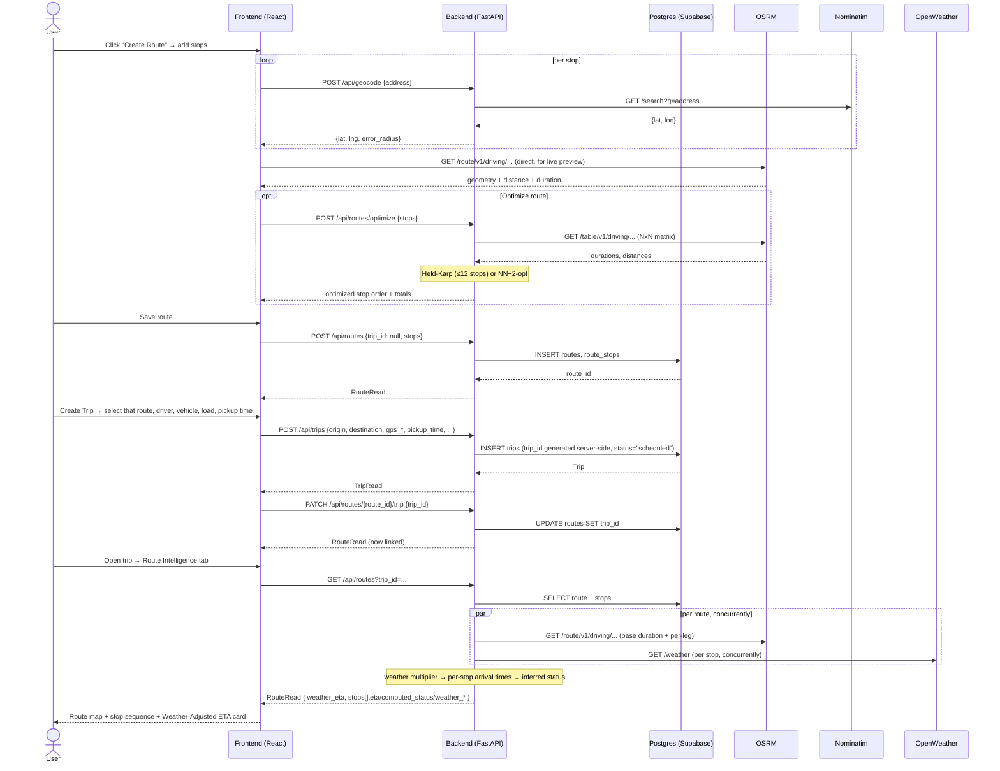

---

## 9. Design rationale & FAQ

**Why can a `Route` exist without a `Trip`?**
Planning and dispatch are treated as separate concerns. A dispatcher might sketch out and optimize
several candidate routes before deciding which trip (driver + vehicle + load) actually uses one —
so `Route.trip_id` is nullable, and `PATCH /routes/{id}/trip` is the explicit "commit this plan to
a trip" step. The UI supports starting from either side (`CreateTripModal`'s route-picker vs. "Build
a new route instead").

**Why is trip status advanced lazily instead of by a background job?**
There's no scheduler/worker process in this stack — just the API and the two frontend-facing
services. Rather than add that infrastructure, `_apply_auto_status_transition` treats "read" as the
trigger: any `GET` that touches a trip is also an opportunity to notice its `pickup_time` or
`actual_delivery_time` has passed and advance it. It's simple and correct for a UI-driven app (a
trip's displayed status is always fresh whenever someone actually looks at it), at the cost of a
trip that nobody reads for a while staying "stale" in the DB until the next read.

**Why does the frontend call OSRM directly instead of always going through the backend?**
Two different jobs, two different latency budgets. The *live preview* while editing a route
(`useRoadRoute`) needs to feel instant on every stop add/reorder — round-tripping through the
backend would add a hop for no benefit, since OSRM's public API is CORS-open and free to call from
a browser. The backend only calls OSRM itself when the result needs to be **computed authoritatively
and combined with other server-side data** — optimizing stop order (needs the full N×N matrix, not
a single route) and the weather-adjusted ETA (needs to be combined with OpenWeather + GPS breadcrumbs
+ the trip's `pickup_time`, none of which the browser has).

**Why is geocoding proxied through the backend, but OSRM isn't?**
Nominatim's usage policy requires a real identifying `User-Agent` header per request, which is
server-side configuration (`GEOCODE_USER_AGENT` in `.env`), not something to hardcode into shipped
browser JS. It's also the natural place to later swap in a paid/keyed geocoder (Mapbox, Google,
LocationIQ) without touching the frontend at all. OSRM's public demo API has no such requirement.

**Why 12 stops as the exact/heuristic solver cutoff?**
Held-Karp is `O(n² · 2ⁿ)`. At `n=12` that's ~590K basic operations — comfortably fast. At `n=20` it's
already ~420M — the cutoff is a deliberate trade: exact optimality for the realistic size of a
single vehicle's stop list, falling back to a fast (if not provably optimal) heuristic for the rare
larger route rather than making the request hang.

**Why does the optimizer minimize duration, not distance?**
The business goal is "get there fastest," and duration already reflects real-world speed limits,
road type, and traffic conditions baked into OSRM's driving profile — a shorter-distance route
isn't necessarily a faster one. Total distance is still computed and returned alongside, purely
for display (and for the toll-cost heuristic, which is per-km).

**Why is the first stop always a fixed starting point, never reordered?**
It's assumed to be a real-world constraint (you start from your depot/current location — you can't
"begin" the trip somewhere else), so both solvers treat index `0` as pinned and only search over
permutations of the remaining stops.

**Why can one route's weather-ETA computation fail without breaking the whole page?**
`_enrich_with_weather_eta` catches `InsufficientRouteDataError`/`HTTPException` per-route and
falls back to the plain route data (`weather_eta = None`) rather than letting one bad route (too
few geocoded stops, OSRM/OpenWeather down) 500 the entire `GET /api/routes` list. Same idea one
level down: `_fetch_all_stop_weather` catches per-*stop* failures so one stop's weather lookup
failing doesn't blank out the others.

---

## 10. API reference

Only the endpoints touched by this slice (excludes `/predictions/*`, `*/eta-prediction`,
`*/cost-prediction`, `*/fuel-cost-estimate` — all ML).

| Method | Path | Purpose | Backend handler |
|---|---|---|---|
| `POST` | `/api/trips` | Create a trip | `trips.create_trip` → `trip_service.create_trip` |
| `GET` | `/api/trips` | List/filter/search trips (search, status, driver, pickup_date) | `trips.list_trips` |
| `GET` | `/api/trips/filter-options` | Distinct statuses/drivers for filter dropdowns | `trips.get_filter_options` |
| `GET` | `/api/trips/{trip_id}` | Get one trip (applies lazy status auto-transition) | `trips.get_trip` |
| `PATCH` | `/api/trips/{trip_id}/status` | Manually set status | `trips.update_trip_status` |
| `PATCH` | `/api/trips/{trip_id}/outcome` | Record the real outcome on completion (`Delivered`/`Delayed`) | `trips.complete_trip` |
| `POST` | `/api/routes` | Create a route + its stops | `routes.create_route` → `route_service.create_route` |
| `GET` | `/api/routes` | List routes (optionally `?trip_id=`), each weather-ETA-enriched | `routes.list_routes` |
| `GET` | `/api/routes/{route_id}` | Get one route, weather-ETA-enriched | `routes.get_route` |
| `PATCH` | `/api/routes/{route_id}/status` | Update route status | `routes.update_route_status` |
| `PATCH` | `/api/routes/{route_id}/trip` | Attach/reassign a route's `trip_id` | `routes.assign_trip` |
| `POST` | `/api/routes/{route_id}/stops` | Append a stop to an existing route | `routes.add_stop` |
| `GET` | `/api/routes/{route_id}/weather-eta` | Just the route-level weather ETA estimate | `routes.get_weather_eta` |
| `POST` | `/api/routes/optimize` | TSP-optimize stop order (not persisted) | `routes.optimize` → `route_optimizer.optimize_route` |
| `POST` | `/api/geocode` | Address → lat/lng, via Nominatim | `geocode.geocode` → `geocode_client.geocode_address` |

---

## 11. File map

```
backend/app/
├── models/
│   ├── trip.py                 # Trip ORM model + status constants
│   └── route.py                # Route, RouteStop ORM models
├── schemas/
│   ├── trip.py                 # TripCreate / TripRead / TripOutcomeUpdate
│   ├── route.py                # RouteCreate / RouteRead / RouteStopRead
│   ├── optimize.py             # OptimizeRouteRequest/Response
│   ├── geocode.py               # GeocodeRequest/Result
│   └── weather_eta.py          # WeatherEtaEstimate
├── services/
│   ├── trip_service.py         # create/list/get trip, status auto-transition, complete_trip
│   ├── route_service.py        # create/list/get route, add stop, assign trip
│   ├── route_optimizer.py      # Held-Karp / NN+2-opt TSP solver, OSRM /table
│   ├── eta_service.py          # weather-adjusted ETA pipeline, OSRM /route + OpenWeather
│   ├── geocode_client.py       # Nominatim client
│   └── weather_client.py       # OpenWeather client
└── api/routes/
    ├── trips.py                # /api/trips endpoints
    ├── routes.py                # /api/routes endpoints (incl. optimize, weather-eta enrichment)
    └── geocode.py               # /api/geocode endpoint

frontend/src/
├── pages/
│   └── TripsPage.tsx           # list + "Create Trip" / "Create Route" entry points
├── components/trip/
│   ├── CreateTripModal.tsx     # 5-step trip wizard
│   ├── CreateRouteModal.tsx    # multi-stop route builder + optimizer trigger
│   ├── RouteIntelligenceTab.tsx# trip-detail tab: map, stop sequence, weather ETA
│   └── RouteMapPreview.tsx     # Leaflet map (stops + route geometry)
├── api/
│   ├── trips.ts                # fetchTrips/fetchTrip/createTrip/updateTripStatus
│   ├── routes.ts               # fetchRoutes(ForTrip)/createRoute/addRouteStop/optimizeRouteOrder/assignRouteToTrip
│   └── geocode.ts              # geocodeAddress
└── hooks/
    ├── useRoadRoute.ts         # direct browser→OSRM call for live map preview
    ├── useRoutes.ts / useRouteForTrip.ts
    └── useTrips.ts / useTripDetail.ts / useTripFilterOptions.ts
```
