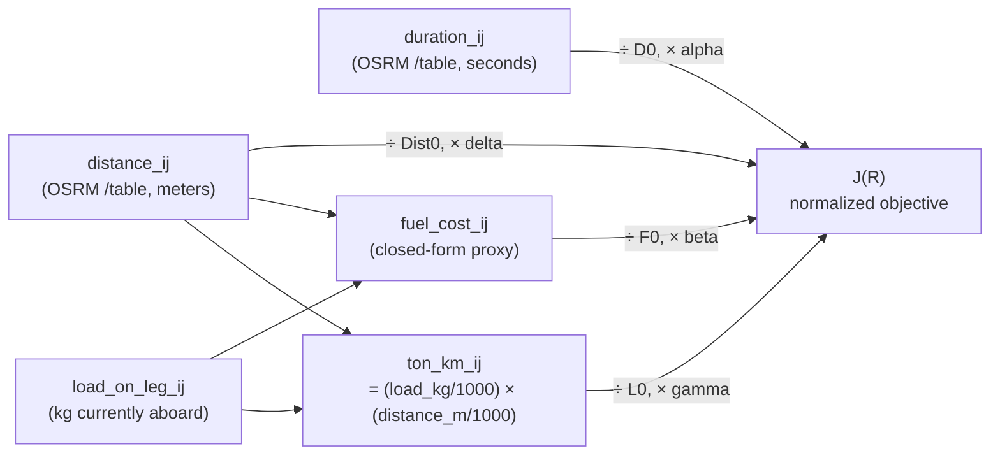
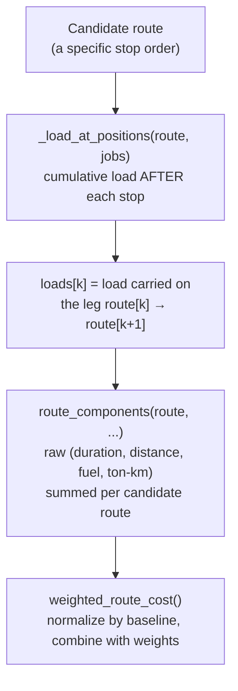

# Multi-Objective Route Optimization: Architecture & Design

> **Status:** implemented. This documents the architecture for the route optimizer's
> **multi-objective** cost model — distance, time, fuel cost, and cargo/load impact evaluated
> together for the same candidate route, normalized so the four terms (meters, seconds, currency,
> tonne-km) are genuinely comparable, and combined with vehicle capacity as a hard constraint —
> plus the 5-step `CreateRouteModal` wizard this depends on. Originally scoped as "weight-aware
> optimization"; broadened after review to the framing below, which is what's actually built. See
> [README.md](./README.md) for the platform overview and [README2.md](./README2.md) for the
> existing trip → route → optimization → weather-ETA slice this extends.

## Table of contents

1. [Problem](#1-problem)
2. [Design principle: no `use_weight` flag](#2-design-principle-no-use_weight-flag)
3. [Cost model](#3-cost-model)
4. [Why the cost can't be a static N×N matrix](#4-why-the-cost-cant-be-a-static-nn-matrix)
5. [Capacity stays a hard constraint](#5-capacity-stays-a-hard-constraint)
6. [End-to-end data flow](#6-end-to-end-data-flow)
7. [File-by-file plan](#7-file-by-file-plan)
8. [The pre-existing capacity-check bug this also fixes](#8-the-pre-existing-capacity-check-bug-this-also-fixes)
9. [Out of scope](#9-out-of-scope)
10. [The 5-step wizard](#10-the-5-step-wizard)

---

## 1. Problem

Three gaps in the current trip → route flow, discovered while reviewing `CreateRouteModal.tsx`
and the optimizer:

- **The optimizer only minimized travel duration.** `ml/src/optimizer/opt.py`'s `route_cost()`
  sums `duration_matrix[i][j]` along the route. Vehicle load only ever acted as a *feasibility
  filter* (`route_is_feasible()` rejects a route if capacity is exceeded anywhere) — it never
  influenced *which feasible route is cheapest*, and distance was reported for display only, never
  weighed as its own objective. Two routes that both fit the vehicle were scored identically
  regardless of how much fuel/effort/distance hauling their respective loads actually cost.
- **Weight gets asked for twice, and blindly.** `CreateTripModal.tsx` doesn't collect weight at
  all; `CreateRouteModal.tsx`'s Load step then force-asks for it per trip with no memory of
  anything entered before, and assigning the route unconditionally overwrites
  `trip.load_weight_kg` with whatever was just typed (`route_service.py:396`).
- **The capacity check itself is order-blind.** Both the frontend gate
  (`CreateRouteModal.tsx`'s `exceedsCapacity`) and the backend's `/routes/assign`
  (`route_service.py:399-406`) compare the **flat sum** of every trip's weight against vehicle
  capacity, not the actual maximum load carried at any single point along the route. A
  sequential pickup→drop→pickup→drop route that never exceeds capacity at any instant can still
  get rejected by this check, purely because it sums instead of tracking state. See
  [§8](#8-the-pre-existing-capacity-check-bug-this-also-fixes).

## 2. Design principle: no `use_weight` flag

The natural first instinct is a single boolean — "does this trip have a weight? if so, use the
weight-aware path, else use the standard one." That framing breaks down once you look at what
`/routes/optimize` actually operates on: **a batch of trips**, not one. `CreateRouteModal`
requires selecting ≥2 trips, and the optimizer receives one pickup+delivery *job* per trip
([`route_optimizer._build_jobs()`](./backend/app/services/route_optimizer.py)). In a real batch,
some trips may have a known weight and others may not — there's no single yes/no answer for
"the route."

So instead of one flag, each cost term is **independently auto-enabled by whether its own inputs
exist**:

| Term | Needs | Auto-enabled when |
|---|---|---|
| `alpha·duration` | duration matrix | always — known from the OSRM matrix regardless of load/vehicle data |
| `delta·distance` | distance matrix | always — same reasoning as duration |
| `gamma·ton_km` | `load_weight_kg`, distance | any job in the batch has `load_weight_kg > 0` |
| `beta·fuel_cost` | load, distance, vehicle `avg_kmpl_rated`, `fuel_price_per_l` | the assigned vehicle's mileage *and* a fuel price are both known |

A job with no weight simply contributes `0` to the load-dependent terms — this already happens
today, incidentally: `route_optimizer.py` already does `pickup_stop.load_weight_kg or 0.0` when
building jobs. Nothing new needs to detect "no weight," it already degrades correctly. What's new
is that *when* weight/vehicle-fuel data exists, it actually changes route selection instead of
being inert. Unlike `beta`/`gamma`, `alpha` and `delta` are never conditional — a route with no
weight/vehicle data still optimizes on distance **and** time together, never falls back to
duration alone the way the first version of this design did.

Net effect: a route with zero known weights still gets a real two-term objective (time + distance);
a route with partial weights gets partial weighting on top; nothing needs a branch on "is this a
weight-aware call or not."

## 3. Cost model

The objective is genuinely **multi-objective** — distance, time, fuel cost, and cargo/load impact,
not "weight-aware optimization" as a single add-on:

```
J(R) = alpha · D_hat(R)  +  delta · Dist_hat(R)  +  beta · F_hat(R)  +  gamma · L_hat(R)
```

where each `_hat` term is **baseline-normalized** (divided by a reference value) before being
weighted — see [§3.1](#31-normalization-why-raw-units-dont-work).



- **`alpha` (duration/time)** and **`delta` (distance)** — always on; distance and duration are
  correlated (both derived from the same OSRM road network) but not interchangeable — a longer,
  faster highway route and a shorter, slower city route trade off differently, and a fleet cares
  about distance independently of time (tyre wear, tolls, distance-proportional costs).
- **`gamma` (ton-km)** — a simple, always-available proxy: heavier cargo hauled further should
  cost more, without needing any vehicle-specific data. `ton_km_ij = (load_kg / 1000) × (distance_m / 1000)`.
- **`beta` (fuel cost)** — a **closed-form proxy**, not a call into the trained fuel-consumption
  ML model. Two reasons: (1) that model needs `weather_condition` / `road_type` /
  `traffic_density` — trip-level categorical fields that don't exist per OSRM matrix *edge*, and
  (2) the LNS solver evaluates this cost function potentially thousands of times per optimize
  call (200 iterations × many candidate insertions) — a per-edge HTTP/inference round-trip is far
  too slow for that hot loop. Instead:

  ```python
  load_factor = 1.0 + LOAD_KMPL_DERATE_PER_TONNE * (load_on_leg_kg / 1000.0)   # e.g. 0.03 = 3%/tonne
  effective_kmpl = max(avg_kmpl_rated / load_factor, avg_kmpl_rated * MIN_KMPL_FRACTION_OF_RATED)
  fuel_liters = distance_km / effective_kmpl
  fuel_cost = fuel_liters * fuel_price_per_l
  ```

  A heuristic linear mileage derating under load, floored so effective mileage never craters
  toward zero under an extreme load. The real trained cost model remains the source of truth for
  the **predicted total trip cost** shown to the user after the fact — it's simply the wrong tool
  for the optimizer's inner loop.

`route_cost()` (pure duration, used for `SolveResult.total_duration_seconds` and by
`features.py`/`train_ml.py`) is **left unchanged**. A new `weighted_route_cost()` is what
construction/LNS acceptance actually compares candidates on, and it reduces to exactly
`alpha * route_cost()` when `beta = gamma = delta = 0` — so any caller not opting in sees identical
route choices to before this existed.

### 3.1 Normalization: why raw units don't work

Summing raw `duration` (seconds, thousands) + `fuel_cost` (currency, hundreds) + `ton_km` (tens)
+ `distance_km` (tens) directly is not meaningful — the relative influence of each term becomes an
accident of unit choice rather than a deliberate business priority, and it breaks down further
once load/distance vary a lot between requests (a 200kg parcel route vs. a 20-tonne full-truck
route swings `ton_km`/`fuel_cost` by orders of magnitude while `duration` barely moves).

The fix: compute a **baseline** for each term once per `solve()`/`hybrid_solve()` call — the raw
totals of a cheap, duration-only reference route (`compute_baselines()`, built via
`construct_greedy()` with default weights, capacity-unconstrained since it only exists to set a
scale) — then divide every candidate's raw totals by that fixed baseline before applying the
business weights:

```python
J(R) = alpha * (D(R) / D0)  +  delta * (Dist(R) / Dist0)  +  beta * (F(R) / F0)  +  gamma * (L(R) / L0)
```

Each `_hat` term is now dimensionless and centered near `1.0` for a "typical" route, so
`alpha/beta/gamma/delta` are genuine relative-priority percentages — e.g. the internal defaults in
`route_optimizer.py` are `alpha=0.20, delta=0.25, beta=0.40 (if fuel data known), gamma=0.15 (if
weight known)` — rather than an arbitrary mix of raw seconds/meters/currency/tonne-km. Baselines
are computed **once up front**, not per candidate (normalizing a route against itself would always
yield `1.0` and destroy all differentiation between candidates), and reused for every construction
and LNS comparison within that one solve.

## 4. Why the cost can't be a static N×N matrix

`duration_ij` and `distance_ij` are genuine per-edge constants — OSRM's `/table` call returns
them once, up front, as an N×N matrix, and that's valid because travel time between two fixed
points doesn't depend on anything else. `fuel_cost_ij` and `ton_km_ij` are **not** edge constants
— they depend on `load_on_leg_ij`, which is **how much cargo is already aboard when you traverse
that edge**, which depends on which pickups/deliveries have already happened earlier in *that
specific candidate route*. The same edge `(i, j)` might carry 0kg in one candidate ordering and
8000kg in another.



So the load-dependent terms must be computed **incrementally, per candidate route**, not looked
up from a precomputed table. The mechanism to do this already exists in `opt.py`:
`_load_at_positions(route, jobs)` already walks a route and returns cumulative load after every
stop (`+load` at each pickup, `-load` at each delivery) — this was built for the capacity
feasibility check, and is the exact same primitive `route_components()` uses to make cost
load-aware. The same `weighted_route_cost()` function is used both for scoring a fully-built
candidate route and inside `best_pair_insertion()`'s per-insertion evaluation, so route selection
and final reported cost never diverge.

## 5. Capacity stays a hard constraint

Nothing here changes: `route_is_feasible()` already checks that cumulative load never exceeds
`vehicle_capacity_kg` **at any position** along the route — not a cost penalty, an outright
rejection of infeasible candidates before they're ever scored. `beta`/`gamma` only affect which
*feasible* route is preferred; they can never make an over-capacity route "affordable" by
outweighing it with a small enough duration term, because over-capacity routes are filtered out
before cost comparison ever happens.

## 6. End-to-end data flow

```mermaid
sequenceDiagram
    participant FE as CreateRouteModal
    participant BE as /api/routes/optimize
    participant OPT as route_optimizer.py
    participant ML as ml_api.py /optimize/pickup-delivery
    participant HS as hybrid_solver.py
    participant O as opt.py

    FE->>BE: stops[], vehicle_capacity_kg,\navg_kmpl_rated, fuel_price_per_l
    BE->>OPT: optimize_route(stops, vehicle)
    OPT->>OPT: _build_jobs() - one job per trip,\nload_weight_kg defaults to 0 if unset
    OPT->>OPT: alpha=0.20, delta=0.25 always on;\nderive beta=0.40 (needs vehicle kmpl+fuel price),\ngamma=0.15 (needs any job weight > 0)
    OPT->>ML: jobs, duration/distance matrices,\nvehicle_capacity_kg, alpha/beta/gamma/delta,\navg_kmpl_rated, fuel_price_per_l
    ML->>HS: hybrid_solve(..., weights=CostWeights(...))
    HS->>O: opt.solve() or exact-verification fallback,\nweights threaded through
    O->>O: compute_baselines() once from a\nduration-only reference route
    O->>O: weighted_route_cost() - normalized by baseline -\nused in construct_greedy / LNS accept-reject
    O->>O: route_is_feasible() - hard capacity gate,\nunaffected by weights
    O-->>HS: SolveResult (route, total_duration, total_distance)
    HS-->>ML: SolveResult
    ML-->>OPT: order, totals, solver_used
    OPT-->>BE: OptimizeRouteResponse
    BE-->>FE: optimized stop order
```

## 7. File-by-file plan

All rows below are implemented.

| File | Change |
|---|---|
| `ml/src/optimizer/opt.py` | `CostWeights` (`alpha/beta/gamma/delta`), `RouteBaselines`, `route_components()` (raw per-route totals), `compute_baselines()`, `estimate_fuel_cost()`, `weighted_route_cost()` (normalizes by baseline when given one). Threaded through `best_pair_insertion()`, `construct_greedy()`, `_repair()`, `solve()`'s LNS comparisons — `solve()` computes baselines once up front. `route_cost()` unchanged (still pure duration; still what `features.py`/`train_ml.py` use). Capacity logic untouched. |
| `ml/src/optimizer/hybrid_solver.py` | Thread `weights`/`baselines` through to `opt.solve()` and the exact-verification fallback in `_insert_job_hybrid`. Document that the ML ranking shortlist itself stays duration-based — retraining it on the normalized multi-objective is out of scope here. |
| `ml/service/ml_api.py` | `PickupDeliveryOptimizeRequest` gains optional `alpha=1.0, beta=0.0, gamma=0.0, delta=0.0, avg_kmpl_rated=None, fuel_price_per_l=None`. Handler builds `CostWeights` and passes to `hybrid_solve`. |
| `backend/app/schemas/optimize.py` | `OptimizeRouteRequest` carries `avg_kmpl_rated`/`fuel_price_per_l` through from the frontend (the `alpha/beta/gamma/delta` weights themselves are internal business policy, not exposed here — see [§9](#9-out-of-scope)). |
| `backend/app/services/route_optimizer.py` | `optimize_route()` sets the internal business weights (`alpha=0.20, delta=0.25` always; `beta=0.40`/`gamma=0.15` conditionally per the table in [§2](#2-design-principle-no-use_weight-flag)) — no boolean flag from the caller — and forwards them to the ML service payload. |
| `frontend/src/components/trip/CreateTripModal.tsx` | Optional weight input; included in `createTrip()` only if filled (`CreateTripPayload.load_weight_kg` already supported this — UI-only addition). |
| `frontend/src/components/trip/CreateRouteModal.tsx` | Split into a 6-step wizard — see [§10](#10-the-6-step-wizard). Load step prefills `loads[tripId].weightKg` from `trip.load_weight_kg` and never force-blocks on it; the Optimize step's capacity check uses the real cumulative-load calculation, not a flat sum. |
| `frontend/src/components/trip/CreateRouteModal.tsx` + `backend/app/services/route_service.py` | Fix the two naive-sum capacity checks — see [§8](#8-the-pre-existing-capacity-check-bug-this-also-fixes). |

## 8. The pre-existing capacity-check bug this also fixes

Independent of the cost-model work, two capacity checks compare the **flat sum** of every
selected trip's weight against vehicle capacity, rather than the true maximum concurrent load
along the actual stop order:

- Frontend: `CreateRouteModal.tsx`'s `totalLoadKg`/`exceedsCapacity` (used to block the wizard's
  Load step).
- Backend: `route_service.py`'s `assign_route` — `total_load_kg = sum(t.load_weight_kg or 0 for t
  in trips)`.

`buildDefaultStops()` always orders all pickups before all deliveries, so for the *default* stop
order, sum-of-all-loads and max-concurrent-load happen to be equal — the bug is invisible until a
user reorders stops (via the up/down arrows in the Trips step) into an interleaved or fully
sequential pattern (pickup A → drop A → pickup B → drop B), at which point the true max
concurrent load can be far below the flat sum, and both checks wrongly reject a genuinely
feasible route.

The fix: replace both with the same cumulative-load-along-the-chosen-order calculation the
optimizer already uses internally (`_load_at_positions`-equivalent logic), so the UI/assign-time
gate always agrees with what the optimizer itself considers feasible.

## 9. Out of scope

- **Retraining the hybrid solver's ML ranking model** (`optimizer_model_pair.joblib`) on a
  weighted objective. It stays duration-based; every candidate it ranks is still exactly
  re-verified by `opt.route_is_feasible()`/`weighted_route_cost()` before acceptance, so
  correctness never depends on the ranking model being weight-aware — only its *speed* at very
  large stop counts (≥`HYBRID_MIN_STOPS = 50`) would benefit, and this app's realistic route
  sizes rarely reach that regime.
- **Calling the trained fuel-consumption/trip-cost ML models per edge.** See [§3](#3-cost-model)
  for why — wrong shape of data, wrong performance profile for a hot loop. Those models remain
  the source of truth for the trip-level predicted cost shown elsewhere in the product.
- **Frontend UI to manually tune `alpha`/`beta`/`gamma`/`delta`.** They're fixed internal business
  weights (`0.20/0.40/0.15/0.25`), each auto-enabled per [§2](#2-design-principle-no-use_weight-flag);
  no dispatcher-facing control for these weights is part of this design.

## 10. The 5-step wizard

`CreateRouteModal` is **Driver → Vehicle → Filter & Validate → Trips → Review**. Driver and
Vehicle are chosen first because every downstream step depends on them: Filter & Validate can't
compute per-trip capacity eligibility without a chosen vehicle's `load_capacity_kg`, and Optimize
can't run the full multi-objective without the vehicle's `avg_kmpl_rated`/fuel data.

**Filter & Validate** layers a new eligibility check (a trip's own weight vs. the chosen vehicle's
capacity - see `tripIneligibilityReason()`) on top of the pre-existing "already routed" rule,
without touching either; it also collects per-trip weight. Trip selection deliberately never
filters on *combined* weight, only a trip's own weight in isolation - a heavy combination can
still be perfectly feasible in the right stop order (see
[§8](#8-the-pre-existing-capacity-check-bug-this-also-fixes)).

**Trips** is where selection, manual stop reordering, and the automated multi-objective optimizer
all live together - by this point in the sequence, driver/vehicle/weight are all already known, so
the optimize button's objective (distance + time + fuel + cargo weight, normalized) is always
fully informed the first time it's clicked, with no need for a separate step or a second pass. The
peak-concurrent-load capacity check (not a flat sum) is validated here too, gating progression to
Review.
