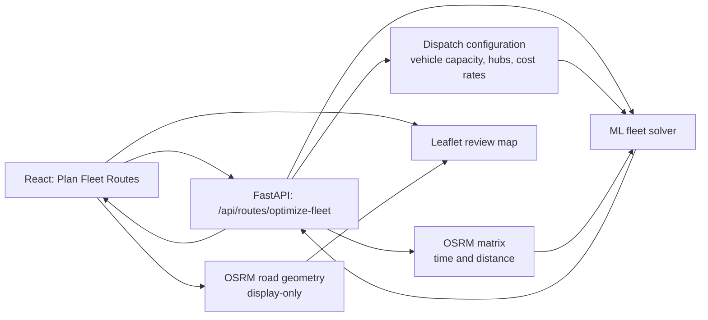
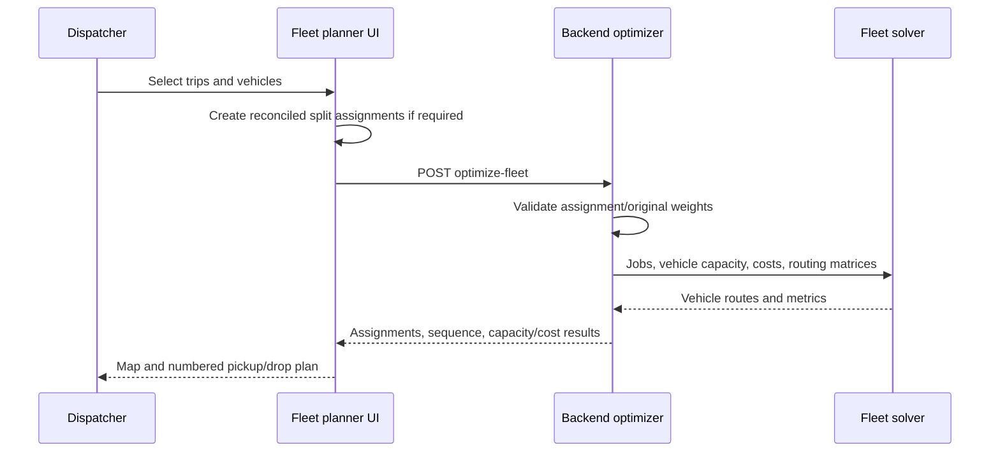
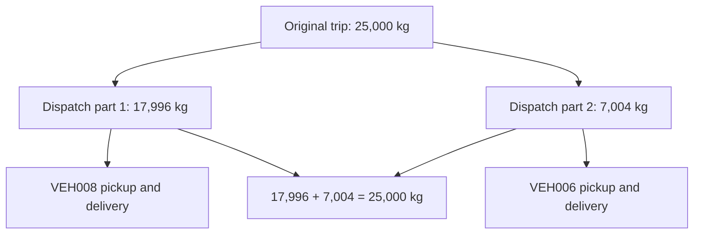
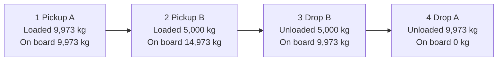

# Plan Fleet Routes

The **Plan Fleet Routes** flow assigns selected trips to selected vehicles and
builds a capacity-safe pickup-and-delivery sequence for each vehicle.

## Architecture



| Layer | Responsibility |
| --- | --- |
| React fleet modal | Selects trips/vehicles, prepares split assignments, presents the review. |
| Backend optimizer | Validates split reconciliation, obtains real matrix/configuration data, and calls the solver. |
| Fleet solver | Finds capacity-safe pickup/delivery sequences and minimizes fleet cost heuristically. |
| OSRM | Provides routing distances/times for optimization and road geometry for the map. |

The review-map geometry is presentation-only. The solver uses the backend's
matrix, not browser map lines, when deciding the plan.

## Flow

1. Select unassigned trips and record their weights.
2. Select the vehicles available for dispatch and optionally assign drivers.
3. Optimize the fleet plan.
4. Review the vehicle assignments, stop sequence, capacity usage, cost, and map.

The optimizer enforces pickup before the corresponding delivery and validates
the cargo on board at every stop against that vehicle's maximum capacity.

### What happens during optimization

The planner does not assign a trip merely because a truck has enough capacity.
It turns every trip into a pickup/delivery job, evaluates where that pair can
be inserted into each vehicle's current sequence, and rejects positions that
would violate a hard constraint. A valid insertion must satisfy all of these:

1. The pickup occurs before the matching delivery.
2. The running load is never negative.
3. The running load never exceeds the vehicle capacity.
4. A split part can only be inserted in a vehicle allowed for that part.
5. The complete set of selected jobs is evaluated against time, distance,
   fuel, operating, driver, and fixed-route cost.
6. The complete Hub → pickup/delivery sequence → Hub route stays within the
   configured maximum duration (12 hours by default).

The route sequence is therefore a dispatch order, not just a list of trips.
For example, `Pickup A → Pickup B → Drop B → Drop A` is valid only if carrying
both A and B at once remains within the truck's capacity.



## Data model and request contract

There are two different weights for a split load. Keeping them distinct is
critical: the original weight belongs to the business trip; the assigned weight
belongs to one vehicle's dispatch job.

| Field | Meaning | Changes after planning? |
| --- | --- | --- |
| `Trip.load_weight_kg` | Original consignment weight recorded for the trip. | No. |
| `original_load_weight_kg` | Original weight copied into every split-job request. | No. |
| `assigned_weight_kg` | Amount carried by one vehicle for one split part. | Created only for the planning request. |
| `allowed_vehicle_ids` | Vehicle restriction for a split part. | Request-only. |
| `peak_load_kg` | Highest simultaneous cargo on a route. | Calculated by the solver. |

An ordinary, unsplit 5,000 kg trip has one pickup/delivery job with a 5,000 kg
assigned weight. A 25,000 kg trip can have two jobs, such as 17,996 kg and
7,004 kg. Those jobs remain two independent pickup/delivery pairs: neither
truck can deliver cargo it did not itself pick up.



## Split loads

If a trip is heavier than every selected vehicle, it can be planned as multiple
vehicle assignments. The source trip's `load_weight_kg` is never changed.

For a 25,000 kg trip, a valid result can be:

```text
Delhi → Dehradun — original trip weight: 25,000 kg
VEH008: 17,996 kg assigned
VEH006:  7,004 kg assigned
Reconciled assigned weight: 25,000 / 25,000 kg
```

Each assignment must be within its assigned vehicle's capacity. Split loads are
explicitly enabled in the optimizer request; an indivisible trip cannot be
silently reduced or split.

### Split request example

```ts
const stops: OptimizeStopInput[] = [
  {
    key: "delhi-dehradun-part-1:pickup",
    trip_id: "delhi-dehradun-part-1",
    stop_type: "pickup",
    load_weight_kg: 17_996,
    assigned_weight_kg: 17_996,
    parent_trip_id: "delhi-dehradun",
    original_load_weight_kg: 25_000,
    allowed_vehicle_ids: ["VEH008"],
    allow_split_loads: true,
    latitude: 28.6139,
    longitude: 77.209,
  },
  // Matching delivery stop and the 7,004 kg VEH006 assignment follow.
];
```

The backend rejects a split if its assigned weights do not sum to the original
trip weight, if assignment and payload weights conflict, or if splitting was
not explicitly allowed.

### Split decision rules

| Situation | Result |
| --- | --- |
| Trip fits at least one selected vehicle | Keep it as one indivisible pickup/delivery job. |
| Trip exceeds every individual selected vehicle but compatible fleet capacity is sufficient | Create explicit, reconciled split jobs. |
| Splitting is not allowed | Keep the trip indivisible; it may be reported unassigned. |
| Split assignments do not equal original weight | Reject the request before routing. |
| No compatible fleet combination can carry the load | Return `NO_FEASIBLE_ASSIGNMENT`. |

The planner compares a small set of valid unequal allocations rather than
forcing a 50/50 split. This produces practical plans quickly, but it is a
heuristic search rather than a mathematical proof that no less expensive split
or vehicle combination exists.

## Review screen

The review displays:

- A **Trip assignment summary** with `Origin → Destination`, original trip
  weight, assigned vehicle(s), and reconciliation totals.
- Each vehicle's maximum capacity and peak/max load.
- The actual optimizer-produced **Pickup & delivery sequence**.
- At every stop, the cargo movement and running load:

```text
1  Pickup  Secunderabad → Madhapur  Loaded: 9,973 kg  On board: 9,973 kg
2  Pickup  Secunderabad → Madhapur  Loaded: 5,000 kg  On board: 14,973 kg
3  Drop    Secunderabad → Madhapur  Unloaded: 5,000 kg  Remaining on board: 9,973 kg
```

- Per-route cargo assigned, distance, time, fuel, and cost.
- A map with solid lines for travel while carrying cargo and dashed lines for
  empty repositioning travel. Numbered map markers match the sequence list.

### Load progression example



The running onboard value is calculated from the same optimizer stop order
that powers the numbered map markers. The displayed peak must not exceed the
vehicle maximum capacity.

### How to read the map and sequence

| UI element | Meaning |
| --- | --- |
| Filled numbered marker | Pickup stop. Cargo is loaded after this stop. |
| Hollow numbered marker | Delivery/drop stop. Cargo is unloaded after this stop. |
| Solid route line | The vehicle has one or more active loads on this leg. |
| Dashed route line | The vehicle is repositioning empty between stops. |
| `Loaded` | Weight added to the vehicle at the listed pickup. |
| `Unloaded` | Weight removed from the vehicle at the listed drop. |
| `On board` / `Remaining on board` | Running cargo after the listed stop. |

The road line between two stops is not a cargo transfer. It is simply the
vehicle travelling to its next optimizer-selected stop. Cargo transfers between
vehicles are not part of this planning model.

## Cost and efficiency

The solver treats feasibility as mandatory. Cost is considered only after a
candidate route passes pickup/delivery and capacity checks. Route totals include
available fuel, driver, operating, and fixed-route costs; when configuration is
incomplete, the UI labels the value as a relative score rather than currency.

```text
total fleet cost
  = sum(vehicle fuel cost
      + vehicle driver cost
      + vehicle operating cost
      + vehicle fixed cost)
```

Long-distance split parts can legitimately make total fleet distance much
larger because each assigned vehicle must travel its own pickup-to-delivery
route. For that reason, a feasible split is not automatically an efficient
split. Review the selected vehicle pair, route distance, fixed cost, and fuel
cost before dispatching a costly multi-vehicle plan.

### Optimizer guarantee and limitation

The implementation guarantees valid route constraints for returned routes. It
uses greedy insertion followed by local-search improvement, so it is efficient
enough for interactive planning but does not certify a global minimum-cost
solution. If an exact optimum is required, the fleet problem needs an
integer-programming/VRP solver and a bounded problem size or longer solve time.

Fleet `peak_load_kg` is the highest peak on any dispatched vehicle route; it is
not the sum of independent route peaks. Monetary, distance, duration and fuel
totals are additive across routes.

## Outcomes

- `SUCCESS`: every selected trip/assignment is feasible.
- `PARTIAL`: at least one trip could not be assigned.
- `NO_FEASIBLE_ASSIGNMENT`: no compatible vehicle combination can serve the
  requested work.
- `MISSING_REQUIRED_DATA`: capacity-constrained planning needs a recorded
  weight.

## Validation

The application verifies:

- split assignments reconcile exactly to the original trip weight;
- each assignment respects its vehicle capacity;
- peak concurrent onboard load respects capacity;
- every Hub-to-Hub route respects the configured maximum duration;
- no delivery occurs before its pickup;
- original trip weights remain unchanged.

### Regression coverage

The optimizer tests cover the principal safety cases:

1. A single vehicle serving jobs that fit.
2. Assignment across multiple vehicles when capacity requires it.
3. Unequal split assignments.
4. Original-weight preservation and assignment reconciliation.
5. Capacity violations and peak-load enforcement.
6. Split-not-allowed request rejection.
7. Fleet-wide infeasibility.

Run all relevant checks from the repository root:

```powershell
python -m pytest backend\tests\test_split_load_contract.py backend\tests\test_fleet_hub_wiring.py ml\tests\test_fleet.py -q
cd frontend
npm.cmd run build
```

### Result-shape example

```ts
type FleetVehicleRoute = {
  vehicle_id: string;
  order: string[];       // pickup/delivery stop keys in solver order
  trip_ids: string[];    // dispatched jobs, including split parts
  metrics: {
    peak_load_kg: number;
    total_cost: number;
    distance_meters: number;
  };
};
```

Run the frontend verification from `frontend`:

```powershell
npm.cmd run build
```
